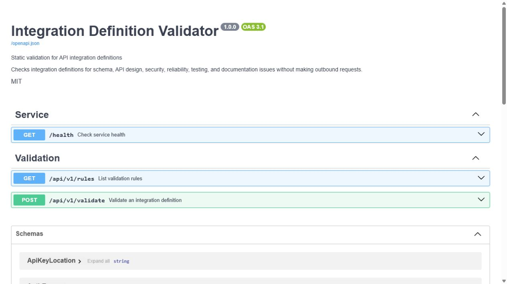

# Integration Definition Validator

Integration Definition Validator is a stateless FastAPI service that reviews a JSON
definition of an API integration before implementation or release. It performs static
checks only: the service never calls the described API and never stores the submitted
definition or report.

## Live deployment

The service is publicly deployed on Google Cloud Run:

- **Swagger UI:** [Interactive API documentation](https://integration-definition-validator-617920646485.europe-west1.run.app/docs)
- **Health check:** [`GET /health`](https://integration-definition-validator-617920646485.europe-west1.run.app/health)
- **OpenAPI schema:** [`/openapi.json`](https://integration-definition-validator-617920646485.europe-west1.run.app/openapi.json)

## Why this exists

Integration definitions tend to encode the same failure modes repeatedly: secrets pasted
into configuration, insecure URLs, retries on unsafe operations, undocumented parameters,
and missing failure tests. Catching those problems in a consistent validation step makes
design reviews faster and gives CI pipelines an objective report: findings, a 0–100 score,
a letter grade, and a pass/fail signal.

## How it works

```text
JSON request
  -> Pydantic structural validation
  -> independent semantic rules
  -> score and severity summary
  -> JSON report
```

The rule engine covers six categories:

| Category | Examples |
| --- | --- |
| API design | unique command/input names, snake_case, path parameters, 2xx responses |
| Security | HTTPS, secret references, auth completeness, least-privilege scopes |
| Reliability | bounded timeouts, retry policy, idempotency, retryable status codes |
| Testing | success, authentication failure, server error, and timeout scenarios |
| Documentation | descriptions, output definitions, and ownership |
| Schema | strongly typed enums, field limits, numeric limits, and collection limits |

The score starts at 100. Critical, error, warning, and info findings deduct 25, 15, 5,
and 0 points respectively, with a floor of zero. A definition is `valid` when it has no
critical or error findings; warnings still reduce its score.

## API

Once running, interactive OpenAPI documentation is available at
[`http://localhost:8080/docs`](http://localhost:8080/docs), ReDoc at
[`http://localhost:8080/redoc`](http://localhost:8080/redoc), and the schema at
[`http://localhost:8080/openapi.json`](http://localhost:8080/openapi.json).



| Method | Path | Purpose |
| --- | --- | --- |
| `GET` | `/` | Redirect to Swagger UI |
| `GET` | `/health` | Service health and version |
| `POST` | `/api/v1/validate` | Validate an integration definition |
| `GET` | `/api/v1/rules` | List every enabled validation rule |

Semantic problems return `200 OK` with findings. A body that does not match the Pydantic
schema returns a structured `422 Unprocessable Entity`; a body larger than 256 KiB returns
`413 Content Too Large`.

### Example request

The complete examples are in
[`examples/valid_integration.json`](examples/valid_integration.json) and
[`examples/invalid_integration.json`](examples/invalid_integration.json).

```bash
curl --request POST http://localhost:8080/api/v1/validate \
  --header "Content-Type: application/json" \
  --data @examples/valid_integration.json
```

A shortened request looks like this:

```json
{
  "name": "Monday Board Integration",
  "description": "Reads and creates items in monday.com boards",
  "version": "1.0.0",
  "base_url": "https://api.monday.com/v2",
  "owner": "ai-integration-team",
  "authentication": {
    "type": "oauth2_client_credentials",
    "credential_references": ["MONDAY_CLIENT_ID", "MONDAY_CLIENT_SECRET"],
    "token_url": "https://auth.monday.com/oauth/token",
    "scopes": ["boards:read", "boards:write"]
  },
  "timeout_seconds": 15,
  "retry_policy": {
    "enabled": true,
    "max_attempts": 3,
    "backoff_strategy": "exponential",
    "retry_on_status_codes": [429, 500, 502, 503, 504]
  },
  "commands": [
    {
      "name": "get_board_items",
      "description": "Returns items from a board",
      "method": "POST",
      "path": "/v2",
      "inputs": [],
      "outputs": [],
      "expected_status_codes": [200],
      "idempotency_key_supported": true,
      "test_cases": []
    }
  ]
}
```

### Example response

The complete valid example produces a perfect report (apart from the generated identifier
and timestamp):

```json
{
  "validation_id": "36e83a67-c988-4e9a-b0da-a44d71e338ad",
  "validated_at": "2026-08-04T12:00:00Z",
  "integration_name": "Monday Board Integration",
  "valid": true,
  "score": 100,
  "grade": "A",
  "summary": {
    "critical": 0,
    "errors": 0,
    "warnings": 0,
    "info": 0
  },
  "findings": []
}
```

Identifiers and timestamps are generated for each request.

## Run locally

Python 3.12 is required.

```bash
python -m venv .venv
```

Activate the environment (`.venv\Scripts\Activate.ps1` on PowerShell or
`source .venv/bin/activate` on macOS/Linux), then install and start the service:

```bash
python -m pip install --upgrade pip
python -m pip install -e ".[dev]"
uvicorn app.main:app --host 0.0.0.0 --port 8080 --reload
```

Optional CORS origins are read from a comma-separated environment variable:

```bash
export CORS_ALLOWED_ORIGINS="https://portal.example.com,https://ci.example.com"
```

## Quality checks

```bash
ruff check app tests
mypy app
pytest --cov=app --cov-report=term-missing --cov-fail-under=85
```

The suite exercises every validation rule in both passing and failing states, endpoint
behavior, scoring, schema errors, exception sanitization, and operational collection/body
limits.

## Docker

```bash
docker build --tag integration-definition-validator:local .
docker run --rm --publish 8080:8080 integration-definition-validator:local
```

To use another host port while keeping the container on Cloud Run's conventional port:

```bash
docker run --rm --publish 9000:8080 integration-definition-validator:local
```

The image runs as a non-root user and reads its listening port from `PORT` (default 8080).

## Deploy to Google Cloud Run

The following source deployment uses the repository Dockerfile. Replace
`YOUR_PROJECT_ID`, ensure billing is enabled, and use credentials authorized for Cloud
Build and Cloud Run:

```bash
gcloud auth login
gcloud config set project YOUR_PROJECT_ID
gcloud services enable run.googleapis.com cloudbuild.googleapis.com artifactregistry.googleapis.com
gcloud run deploy integration-definition-validator \
  --source . \
  --region europe-west1 \
  --allow-unauthenticated \
  --min 0 \
  --max 3
```

After deployment, obtain the assigned service URL and open its `/docs` path:

```bash
SERVICE_URL="$(gcloud run services describe integration-definition-validator --region europe-west1 --format='value(status.url)')"
echo "${SERVICE_URL}/docs"
```

**Live demo:** not deployed yet. Add the real `${SERVICE_URL}/docs` link here only after
verifying the deployment. The Swagger screenshot above was captured from the locally
running service and should be refreshed from the deployed service after publication.

## Security and operational behavior

- Request bodies are limited to 256 KiB.
- A definition may contain at most 100 commands, 100 inputs and 100 outputs per command,
  and 50 test cases per command.
- Logs contain validation metadata and counts, not request bodies, tokens, passwords,
  sensitive examples, or complete credential values.
- The service has no database, persistence layer, user authentication, or outbound HTTP
  client.
- CORS is disabled unless explicitly configured.

## Known limitations

- Input is JSON only; YAML and uploaded files are outside the MVP.
- The service validates a purpose-built integration model, not OpenAPI documents.
- Secret detection is heuristic and cannot identify every credential format.
- Rules are currently fixed in code and cannot be customized per organization.
- No validation history, UI dashboard, user authentication, rate limiting, or live API
  probing is included.

## Future improvements

Potential extensions include JSON/YAML file upload, OpenAPI import, configurable policies
and score thresholds, HTML reports, GitHub pull-request checks, and optional validation
history. Those additions should preserve the current engine's deterministic, no-outbound
default behavior.

## License

Released under the [MIT License](LICENSE).
